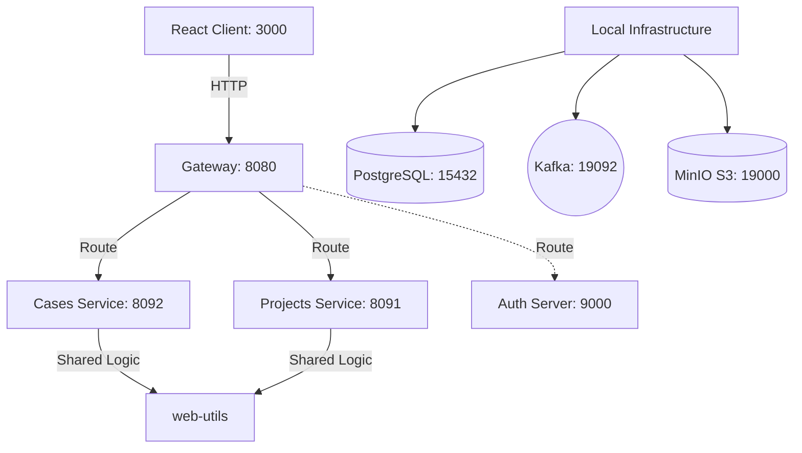

# ProTEST (Test Management System)

**ProTEST TMS** — это распределенная система управления тестированием на микросервисной архитектуре. Проект предназначен для создания и хранения тест-кейсов, логического разделения по проектам, проведения запусков и сбора статистики автоматизированного и ручного тестирования.

---

## **Технологии, использованные в ProTEST TMS**

- [Spring Boot 4](https://spring.io/projects/spring-boot)
- [Spring Authorization Server 1/2](https://spring.io/projects/spring-authorization-server)
- [Spring Security](https://spring.io/projects/spring-security)
- [Spring Data JPA](https://spring.io/projects/spring-data-jpa)
- [Spring Web](https://docs.spring.io/spring-framework/docs/current/reference/html/web.html#spring-web)
- [Spring Actuator](https://docs.spring.io/spring-boot/docs/current/reference/html/actuator.html)
- [Flyway Migration 11](https://flywaydb.org/)
- [Lombok 1.18](https://projectlombok.org/)
- [Apache Kafka 3 (KRaft mode)](https://kafka.apache.org/)
- [MinIO S3](https://min.io/)
- [WireMock 3](https://wiremock.org/)
- [Docker & Docker Compose](https://www.docker.com/)
- [Postgres 17](https://www.postgresql.org/about/)
- [React 19](https://ru.reactjs.org/docs/getting-started.html)
- [JUnit 6](https://junit.org/)
- [Retrofit 3 & OkHttp 5](https://square.github.io/retrofit/)
- [Selenide 7](https://selenide.org/)
- [Java 21](https://adoptium.net/en-GB/temurin/releases/)
- [Gradle 9](https://docs.gradle.org/9.0.0/release-notes.html)

---

**Схема проекта**



---

# Минимальные предусловия для работы 

#### 0. Если у вас ОС Windows
Необходимо использовать **bash terminal** (git bash, wsl), а не powershell. Обязательно добавьте bash терминал в качестве терминала в вашей IDE.

#### 1. Установить docker (Если не установлен)
Мы используем Docker для запуска баз данных, Kafka и MinIO S3.
- [Установка на Mac](https://docs.docker.com/desktop/install/mac-install/)
- [Установка на Windows](https://docs.docker.com/desktop/install/windows-install/)

После установки убедитесь, что docker daemon запущен: `docker -v`.

#### 2. Спуллить контейнеры postgres:17-alpine, apache/kafka:3.7.0, minio/minio
```bash
docker pull postgres:17-alpine
docker pull apache/kafka:3.7.0
docker pull minio/minio:RELEASE.2024-01-28T22-35-53Z
```

#### 3. Запустить инфраструктуру (БД, Kafka, MinIO)
Запустите скрипт из корня проекта:
```bash
bash localenv.sh
```
*Этот скрипт поднимет контейнеры и автоматически создаст базы данных `protest-auth`, `protest-projects`, `protest-cases`, `protest-runs`.*

#### 4. Установить Java 21
Проверьте установленную версию: `java -version`.

#### 5. Установить Node.js и npm (для фронтенда)
Рекомендуется Node.js версии 20+.

---

# Локальный запуск:

#### 1. Запуск Frontend (React)
Перейдите в каталог фронтенда, установите зависимости и запустите dev-сервер:
```bash
cd client
npm install
npm run dev
```
Фронтенд будет доступен по адресу: http://localhost:3000/

#### 2. Запуск Backend (микросервисы)
Запустить в IDE следующие Application-классы с активным профилем `local`:
- `ProjectApplication` (сервис управления проектами)
- `TestCaseApplication` (сервис тест-кейсов)
- `GatewayApplication` (маршрутизатор запросов)

*API Gateway доступен по адресу: http://localhost:8080*
